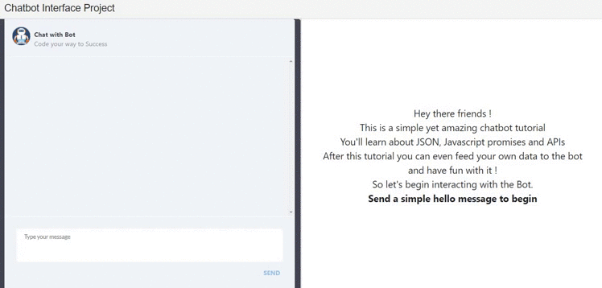

# CHAT-BOT

*A Chatbot like experience created using **HTML**, **CSS**, **Javascript** and some APIs to **fetch dynamic data***
 
 
 

 
 

# Features
- Bot can fetch **jokes** dynamically.
- It can fetch **news** dynamically.
- It can also fetch **Quotes**.
 
 

# Demo
Here is a working live demo : https://snchat-bot.herokuapp.com/
 
 

# Setup
- Clone this repo to your desktop using `git clone` command.
- Disable cors in your browser before running the chatbot
 
 

# How to Contribute
 1.Clone repo and create a new branch: `$ git checkout https://github.com/Sumit-Narwani/Chat-Bot.git -b `name_for_new_branch.
  
2.Make changes and test
 
3.Submit Pull Request with comprehensive description of changes

